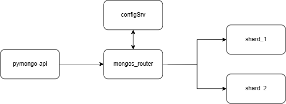
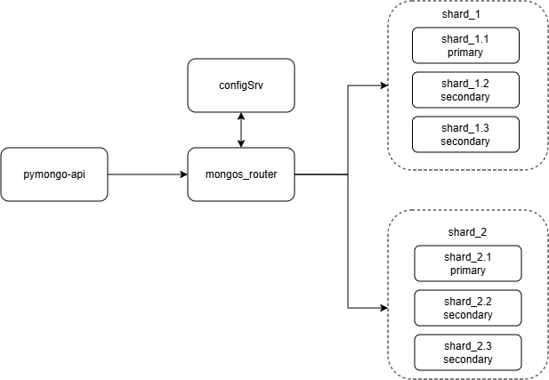
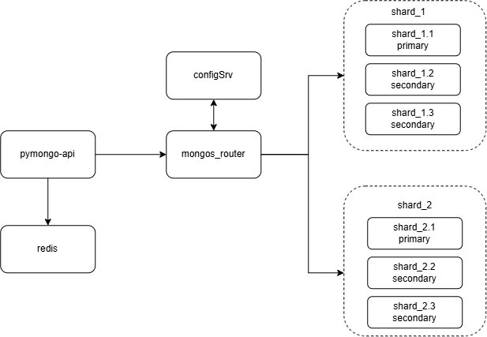
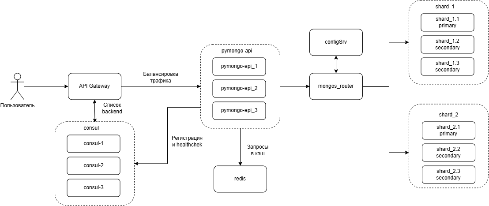
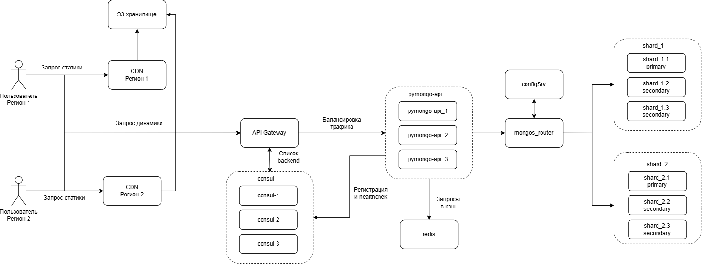

## Структура репозитория
* **`/mongo-sharding`** — Результат Задания 2: Базовое горизонтальное масштабирование (Шардирование MongoDB).
* **`/mongo-sharding-repl`** — Результат Задания 3: Обеспечение высокой доступности (Репликация для каждого шарда).
* **`/sharding-repl-cache`** — **Итоговый демонстрационный стенд (Задание 4)**. Включает в себя финальную реализацию: приложение, Redis-кэш и MongoDB с шардированием и репликацией.
* **`/docs`** — Архитектурные схемы.

## Схемы архитектуры по этапам.

### Шардирование



### Шардирование + репликация



### Шардирование + репликация + кеширование



### Service Discovery и балансировка (API Gateway + Consul)



### Итоговая схема (+ CDN)



## Инструкция по запуску демонстрационного стенда

Проверка финальной реализации проекта осуществляется в директории **`sharding-repl-cache`**. Настройка репликации шардов, конфигурация роутера MongoDB и наполнение базы валидными тестовыми данными происходят полностью автоматически при развертывании.

### Шаг 1. Переход в целевую директорию
```shell
cd sharding-repl-cache
```

### Шаг 2. Развертывание инфраструктуры одной командой
Запустите сборку контейнеров в фоновом режиме:
```shell
docker compose up -d
```

Откройте в браузере адрес: **`http://localhost:8080`**

* `"mongo_topology_type": "Sharded"` — подтверждает успешное подключение к роутеру кластера.
* `"documents_count": 1500` — общее количество сгенерированных пользователей.
* В блоке `"shards"` для `shard1` и `shard2` перечислены все 3 реплики для каждого узла.


